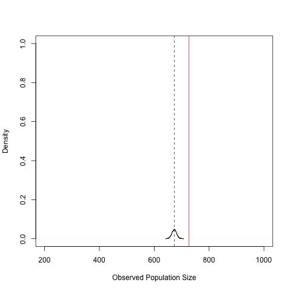
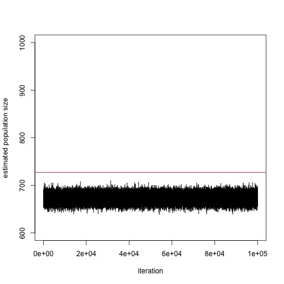

# Abstract

This is a tutorial of Bayesian record linkage for people without Bayesian statistics background. Record linkage is a method of finding and removing duplicate entities in one or multiple data-sets. First, we provide an overview of background learning material of Bayesian statistics and record linkage. Then, we walk through a Bayesian graphical record linkage model and its related derivations. At last, we apply the record linkage model to a a real-world data-set and provide detailed code. This tutorial serves as an introduction to theory, application, and implementation of record linkage and provides resources for readers who are interested in delving deeper into the topic.

\newpage

\tableofcontents

\newpage


# Introduction

The goal of this report is to serve as a tutorial of Bayesian record linkage, especially for people without previous background in Bayesian statistics. This report is a product of the author's independent study course at Duke University's Department of Statistical Science, under the supervision of Professor Rebecca Steorts. In the independent study, the author reproduces all derivations, code and analysis of the SMERED paper [@SMERED]. 

First, in Section 2 [Background Material], we detail background knowledge that one needs to master, provides suggested study material and gives advice on the sequence of approaching the material. Then, in Section 3 [Independent Fields Model and Derivations] the report shows detailed derivations of the model in the SMERED paper. Finally, in Section 4 [Simplified Gibbs Sampler and Experiment], the report would go through an R reproduction of applying the model to the National Long Term Care Survey (NLTCS) data set, a longitudinal study of the health of elderly individuals.

Record linkage, also known as entity resolution, is a method of finding and removing duplicate entities in one or multiple data sets, in the absence of a unique identifier (for example, social security number) [@rl_tutorial_intro]. Record linkage can be a challenging task because of poor data quality that result in noise in data-set. [Figure \ref{rl-example}](#rl-example) shows an illustrating example of record linkage [@rl_tutorial]. Suppose we have three separate data-sets: customer information of Apple, Amazon and Google. Say we would like to know if Steve Fienberg in the Apple data-set, Stephen Fienberg in the Amazon data-set and Steve F**ei**nberg in the Google data-set are the same person. As we are already able to see, their names are spelled slightly differently. In addition, each of them might have other information associated with them -- age, address, etc. We could apply record linkage to identify whether the three people are the same person by analyzing information associated with these people.

{width=60%}


# Background Material

## List of Recommended Reading Material

In this section, we give a brief list of recommended reading material before diving into the [@SMERED] paper. One could alternatively use those as resources along the way.

* Textbook *A First Course in Bayesian Statistical Methods* [@hoff]
* Professor Steorts' lecture materials of STA 360/602 Modern Bayesian Statistics offered at Duke University [@STA360]
  * See `readings` folder for *Some of Bayesian Statistics: The Essential Parts* [@STA360]
* Professor Steorts' tutorial on record linkage [@rl_tutorial]
* Professor Steorts' JASA paper [@JASA]
* An excellent free Coursera online course from Stanford University about Probabilistic Graphical Models [@pgm]
* And, of course, the paper we aim to study in this tutorial: Professor Steorts' SMERED paper [@SMERED]


## A Brief Introduction to Record Linkage

In this section, we highly recommend completing a brief tutorial on record linkage to obtain an intuitive understanding of the area [@rl_tutorial].

For a more in depth study of the area, we refer the reader to [@christen2012].

## Bayesian Statistics

In this section, we provide a high level overview of [@SMERED] and what prior knowledge of Bayesian statistics is needed.

For now, do not worry if some terms in the following text are unfamiliar to you. Section 2.1 in the [@SMERED] paper introduces *independent fields model*. This is a *hierarchical model*. A hierarchical model is a statistical model written in multiple levels, i.e. hierarchical form [@hierarchical].  We would need some knowledge of how to work with hierarchical models to derive useful information from it. More specifically, we would need to go through deriving *joint posterior* and *full conditionals*. You would be able to see the joint posterior in Section 2.1 of [@SMERED], and the full conditionals in [@JASA]. Full conditionals are needed to code up a *Gibbs sampler*, which we would use on the actual data-set.

Having seen what the paper roughly contains, let's now look at suggested learning path of Bayesian statistics for the purpose of this tutorial:

* Chapter 1 in [@hoff] introduces the reader to the foundation of Bayesian statistics.

* If one would like to brush up on on probability, it is highly recommended to read Chapter 2 of [@hoff].

* Section 2.1 of [@SMERED] outlines the independent fields mode. If the distributions involved in the model is unfamiliar, it is recommended to look them up. The books and slides suggested above can contain useful information about those distributions.
    * Tip: The Dirichlet distribution might be harder to understand than others. Dirichlet distribution can be seen as the multivariate version of Beta distribution. If one is uncomfortable with multivariate distributions, it is recommended to go through multivariate normal distribution in [@hoff].

* It is important to understand the idea of conjugacy and be able to derive conjugate distributions. Chapter 3 of [@hoff] is helpful. It is recommended to be able to perform derivations. Exercises associated with thous chapters are highly recommended.

* Up to this point, one should have enough knowledge to be able to derive the joint posterior in Section 2.1 of [@SMERED] We will go through the derivation in detail later in this tutorial.

* To understand full conditionals and Gibbs sampler, it is recommended to read Chapter 4 and Chapter 6 of [@hoff]. For details of deriving full conditionals, see [@fc_deriv] for a good tutorial.


# Independent Fields Model and Derivations

In this section, we first list assumptions and notations about the SMERED model. Then, we flesh out derivations of the joint posterior and full conditionals.


## Assumptions

We assume all files contain the same number of fields (features), and every record (think of a row in a file) contains no missing data.

## Notation

* $i =1, .., k$ denotes files. There are $k$ files or lists
* $j = 1, ..., n_i$ is the numbering of records. There are $n_i$ number of records
* $l = 1, ..., p$ denotes fields(features). There are $p$ fields in each file
* $m = 1, ..., M_l$ denotes levels(categories) of Field $l$. Field $l$ has $M_l$ levels
* $\mathbf{x}_{ij}$ denotes data for the $j^{th}$ record in file $i$, where $i = 1, ..., k$, $j = 1, ..., n_i$, and $n_i$ is the number of records in file $i$
* $j' = 1, ..., N$ see $\mathbf{y}_{j'}$ for definition
* $\mathbf{y}_{j'}$ denotes latent vector of true field values for the $j'^{th}$ individual in the population, where $j' = 1, ..., N$, and $N$ being the total number of $\textit{observed}$ individuals from the population
* $\boldsymbol{\Lambda} = \{\lambda_{ij}; i = 1, ..., k; j = 1, ..., n_i\}$, where $\lambda_{ij} \in \{ 1, 2, ..., N_{max}\}$, indicating which latent individual the $j^{th}$ record in file $i$ refers to
* $z_{ijl}$ is distortion. It takes value of $1$ or $0$ according to whether or not field $l$ in $\mathbf{x}_{ij}$ is distorted
* $I$ denotes indicator functions
* $\delta_a :=$ distribution of a point mass at $a$
* $\boldsymbol{\theta}_l:=$ multinomial probabilities. Length of $\boldsymbol{\theta}_l = M_l$

Please refer to [@SMERED] for a more fleshed-out explanation of notation.


## Independent Fields Model

Here, we copy the independent fields model from [@SMERED] for ease of reference.

$$
\begin{aligned}
  \boldsymbol{x}_{ijl} | \lambda_{ij}, \boldsymbol{y}_{\lambda_{ij}l}, z_{ijl}, \boldsymbol{\theta}_l &\stackrel{ind}{\sim}
  \begin{cases}
  \delta_{\boldsymbol{y}_{\lambda_{ij}l}} & \text{if $z_{ijl} = 0$} \\
        \text{MN}(\boldsymbol{\theta}_l)  & \text{if $z_{ijl} = 1$}
  \end{cases} \\
  z_{ijl} &\stackrel{ind}{\sim} \text{Bernoulli}(\beta_l) \\
  \boldsymbol{y}_{j'l} | \boldsymbol{\theta}_{jl} &\stackrel{ind}{\sim} \text{MN}(\boldsymbol{\theta}_l) \\
  \boldsymbol{\theta}_l &\stackrel{ind}{\sim} \text{Dirichlet}(\boldsymbol{\mu}_l) \\
  \beta_l &\stackrel{ind}{\sim} \text{Beta}(a_l, b_l) \\
  \pi(\boldsymbol{\Lambda}) &\propto 1,
\end{aligned}
$$
where $\alpha_l$, $\beta_l$, and $\boldsymbol{\mu}_l$ are all known, and MN denotes the Multinomial distribution. We put a uniform prior on $\Lambda$.

## Directed Acyclic Graph (DAG) of Independent Fields Model

[Figure \ref{DAG}](#DAG) is the directed acyclic graph (DAG) representation of the independent fields model [@rl_tutorial]. Please see [@pgm] for details about what they are and how to interpret them. This kind of model is known as a Bayesian network, a type of probabilistic graphical model that represents a set of variables and their conditional dependencies. Each node represents a variable in the Independent Fields Model. Unshaded nodes represent latent variables while shaded node represents observed variables. The edges represent conditional dependencies. The plates represent duplication.

Understanding how to identify conditional dependencies in a Bayesian network is crucial for being able to derive full conditionals by allowing us to simplify the expressions of full conditionals. It takes several classes to explain this in detail, so please see [@pgm] for a an excellent free Coursera online course from Stanford University to learn about how to identify conditional dependencies and graphical representations of Bayesian networks.

{width=50%}


## Derivation of Joint Posterior without Indices

To simplify the derivation, we first start with deriving the joint posterior without indices.

The joint posterior can be written as:

$$
\begin{aligned}
\pi(\lambda, y, z, \theta, \beta | x) & \propto p(x | \lambda, y, z, \theta, \beta) p(\lambda, y, z, \theta, \beta) \\
& \propto p(x | \lambda, y, z, \theta) p(\lambda, y, z, \theta, \beta) &  z \text{ is determined by } \beta \\
& \propto p(x | \lambda, y, z, \theta) p(y, z, \theta, \beta | \lambda)p(\lambda) \\
& \propto p(x | \lambda, y, z, \theta) p(y, z, \theta, \beta | \lambda) & p(\lambda) \propto 1 \\
& \propto p(x | \lambda, y, z, \theta) p(\beta, z | \lambda) p(y, \theta | \lambda) \\
& \propto p(x | \lambda, y, z, \theta) p(\beta, z | \lambda) p(\lambda) p(y, \theta | \lambda) p(\lambda) \\
& \propto p(x | \lambda, y, z, \theta) p(\beta, z, \lambda) p(y, \theta, \lambda) \\
& \propto p(x | \lambda, y, z, \theta)p(\beta, z)p(\lambda)p(y,\theta)p(\lambda) & \text{by independence given by the hierarchical model}\\
& \propto p(x | \lambda, y, z, \theta)p(\beta, z)p(y,\theta) \\
& \propto p(x | \lambda, y, z, \theta)p(\beta | z)p(z)p(\theta|y)p(y)
\end{aligned}
$$
Now, we have a product of likelihood of data, Bernoulli-Beta distribution, Bernoulli distribution, Multinomial-Dirichlet distribution, and Dirichlet distribution. Referring to the hierarchical model, such product can be written out in closed form. Notice that Bernoulli-Beta and Multinomial-Dirichlet can be derived using conjugacy.


## Derivation of Joint Posterior with Indices

$\boldsymbol{\Lambda}$ is a matrix whose $i,j$ entry is $\lambda_{ij}$, where $i = 1, ..., k$, $j = 1, ..., n_i$.
$\boldsymbol{y}$ is a vector whose $j'$th entry is $y_{j'}$, where $j' = 1, ..., N$, $N$ being the total number of observed individuals from the population.
$\boldsymbol{z}$ is a list of matrices where each entry in a matrix is $z_{ijl}$, $i = 1, ..., k$, $j = 1, ..., n_i$, $l = 1, ..., p$.
$\boldsymbol{\theta}$ is a vector whose $l$th entry is $\boldsymbol{\theta}_l$.
$\boldsymbol{\beta}$ is a vector whose $l$th entry is $\beta_l$.
$\boldsymbol{x}$ is all data whose $i,j$ entry is $\boldsymbol{x}_{ij}$, where $i = 1, ..., k$, $j = 1, ..., n_i$.


Continuing from the last expression above, we add indices and proceed with our derivation. Adding indices, we obtain:

$$
\begin{aligned}
p(\boldsymbol{\Lambda}, \boldsymbol{y}, \boldsymbol{z}, \boldsymbol{\theta}, \boldsymbol{\beta}| \boldsymbol{x}) \propto p(\boldsymbol{x} | \boldsymbol{\Lambda}, \boldsymbol{y}, \boldsymbol{z}, \boldsymbol{\theta})p(\boldsymbol{\beta} | \boldsymbol{z})p(\boldsymbol{z})p(\boldsymbol{\theta}|\boldsymbol{y})p(\boldsymbol{y})
\end{aligned}
$$

We proceed by deriving each term in the above expression separately.

First, we derive $p(\boldsymbol{x} | \boldsymbol{\Lambda}, \boldsymbol{y}, \boldsymbol{z}, \boldsymbol{\theta})$.

$$
\begin{aligned}
& p(\boldsymbol{x} | \boldsymbol{\Lambda}, \boldsymbol{y}, \boldsymbol{z}, \boldsymbol{\theta}) \\
& = \prod_{i,j,l} p(x_{ijl} | \boldsymbol{\Lambda}, \boldsymbol{y}, \boldsymbol{z}, \boldsymbol{\theta}) \\
& = \prod_{i,j,l} [(1-z_{ijl})\delta_{\boldsymbol{y}_{\lambda_{ij}l}} +
    \prod_{m} z_{ijl}\theta_{lm}^{I(x_{ijl}=m)}] \\
& = \prod_{i,j,l,m} [(1-z_{ijl})\delta_{\boldsymbol{y}_{\lambda_{ij}l}} +
    z_{ijl}\theta_{lm}^{I(x_{ijl}=m)}]
\end{aligned}
$$

Then, we derive $p(\boldsymbol{\beta} | \boldsymbol{z})p(\boldsymbol{z})$.

$$
\begin{aligned}
& p(\boldsymbol{\beta} | \boldsymbol{z})p(\boldsymbol{z}) \\
& = p(\boldsymbol{z}|\boldsymbol{\beta})p(\boldsymbol{\beta})\cdot \frac{1}{p(\boldsymbol{z})} \cdot p(\boldsymbol{z}) \\
& = p(\boldsymbol{z}|\boldsymbol{\beta})p(\boldsymbol{\beta})\cdot \\
& \propto \prod_l \beta_l^{\sum_{i=1}^k \sum_{j=1}^{n_i} z_{ijl}}
    (1-\beta_l)^{\sum_{i=1}^k \sum_{j=1}^{n_i}(1-z_{ijl})}
    \cdot \prod_l \beta_l^{a_l-1}(1-\beta_l)^{b_l-1} \\
& \propto \prod_l [\beta_l^{a_l-1+\sum_{i=1}^k \sum_{j=1}^{n_i} z_{ijl}}
    \cdot (1-\beta_l)^{b_l-1+\sum_{i=1}^k \sum_{j=1}^{n_i}(1-z_{ijl})}]
\end{aligned}
$$

Finally, we derive $p(\boldsymbol{\theta}|\boldsymbol{y})p(\boldsymbol{y})$.

$$
\begin{aligned}
& p(\boldsymbol{\theta}|\boldsymbol{y})p(\boldsymbol{y}) \\
& = p(\boldsymbol{y}|\boldsymbol{\theta})p(\boldsymbol{\theta})
    \cdot \frac{1}{p(\boldsymbol{y})} \cdot p(\boldsymbol{y}) \\
& = p(\boldsymbol{y}|\boldsymbol{\theta})p(\boldsymbol{\theta}) \\
& \propto \prod_l [\prod_m \theta_{lm}^{\sum_{j'=1}^N I(y_{j'l}=m)}
    \cdot \prod_m \theta_{lm}^{\mu_{lm}-1}] \\
& \propto \prod_{l,m} \theta_{lm}^{\mu_{lm}-1+\sum_{j'=1}^N I(y_{j'l}=m)}
\end{aligned}
$$

Finally, combining the three terms we derived above, we obtain:

$$
\begin{aligned}
p(\boldsymbol{\Lambda}, \boldsymbol{y}, \boldsymbol{z}, \boldsymbol{\theta}, \boldsymbol{\beta}| \boldsymbol{x}) & \propto p(\boldsymbol{x} | \boldsymbol{\Lambda}, \boldsymbol{y}, \boldsymbol{z}, \boldsymbol{\theta})p(\boldsymbol{\beta} | \boldsymbol{z})p(\boldsymbol{z})p(\boldsymbol{\theta}|\boldsymbol{y})p(\boldsymbol{y}) \\
& \propto \prod_{i,j,l,m} [(1-z_{ijl})\delta_{\boldsymbol{y}_{\lambda_{ij}l}} +
    z_{ijl}\theta_{lm}^{I(x_{ijl}=m)}] \\
& \times \prod_{l,m} \theta_{lm}^{\mu_{lm}-1+\sum_{j'=1}^N I(y_{j'l}=m)} \\
& \times \prod_l [\beta_l^{a_l-1+\sum_{i=1}^k \sum_{j=1}^{n_i} z_{ijl}}
    \cdot (1-\beta_l)^{b_l-1+\sum_{i=1}^k \sum_{j=1}^{n_i}(1-z_{ijl})}]
\end{aligned}
$$


## Derivation of Full Conditionals


### Full Conditional of $\beta_l$

First, we derive the full conditional of $\beta_l$.

$$
\begin{aligned}
& p(\beta_l | \boldsymbol{\Lambda}, \boldsymbol{z}, \boldsymbol{\theta}, \boldsymbol{y}, \boldsymbol{x}) \\
& = p(\beta_l | \boldsymbol{z}_l) & \text{removing variables conditionally independent of } \beta_l\\
& \propto p(\boldsymbol{z}_l | \beta_l) p(\beta_l) \\
& \propto \left[  \prod_{i = 1}^k \prod_{j = 1}^{n_i} p(z_{ijl} | \beta_l) \right] p(\beta_l) \\
& \propto \left[  \prod_{i = 1}^k \beta_l^{\sum_{j = 1}^{n_i} z_{ijl}} (1 - \beta_l)^{n_i - \sum_{j = 1}^{n_i} z_{ijl}} \right] p(\beta_l) \\
& \propto \left[  \beta_l^{\sum_{i = 1}^k \sum_{j = 1}^{n_i} z_{ijl}} (1 - \beta_l)^{\sum_{i = 1}^k(n_i - \sum_{j = 1}^{n_i} z_{ijl})} \right] p(\beta_l) \\
& \propto \left[  \beta_l^{\sum_{i = 1}^k \sum_{j = 1}^{n_i} z_{ijl}} (1 - \beta_l)^{\sum_{i = 1}^k(\sum_{j = 1}^{n_i}1 - \sum_{j = 1}^{n_i} z_{ijl})} \right] p(\beta_l) \\
& \propto \left[ \beta_l^{\sum_{i = 1}^k \sum_{j = 1}^{n_i} z_{ijl}} (1 - \beta_l)^{\sum_{i = 1}^k \sum_{j = 1}^{n_i} (1 - z_{ijl})} \right] \beta_l^{a_l - 1} (1 - \beta_l)^{b_l - 1} \\
& \propto \beta_l^{a_l + \sum_{i = 1}^k \sum_{j = 1}^{n_i} z_{ijl} - 1} (1 - \beta_l)^{b_l + \sum_{i = 1}^k \sum_{j = 1}^{n_i} (1 - z_{ijl}) - 1}
\end{aligned}
$$

Hence,

$$
\begin{aligned}
& \beta_l | \boldsymbol{\Lambda}, \boldsymbol{z}, \boldsymbol{\theta}, \boldsymbol{y}, \boldsymbol{x} \\
& \sim \operatorname{Beta}\left(a_{\ell}+\sum_{i=1}^{k} \sum_{j=1}^{n_{i}} z_{i j \ell}, b_{\ell}+\sum_{i=1}^{k} \sum_{j=1}^{n_{i}}\left(1-z_{i j \ell}\right)\right)
\end{aligned}
$$


### Full Conditional of $\boldsymbol{\theta}_{l}$

Next, we derive the full conditional of $\boldsymbol{\theta}_{l}$.

$$
\begin{aligned}
& p(\boldsymbol{\theta}_l | \boldsymbol{\Lambda}, \boldsymbol{z}, \boldsymbol{y}, \boldsymbol{\beta}, \boldsymbol{x}) \\
& \propto p(\boldsymbol{\theta}_l | \boldsymbol{\Lambda}, \boldsymbol{z}, \boldsymbol{y}, \boldsymbol{x}) & \text{removing conditionally indepedent variables} \\
& \propto p(\boldsymbol{\theta}_l | \boldsymbol{\Lambda}, \boldsymbol{z}_l, \boldsymbol{y}_l, \boldsymbol{x}_l) & \text{removing conditionally indepedent variables} \\
& \propto p(\boldsymbol{x}_l | \boldsymbol{\Lambda}, \boldsymbol{y}_l, \boldsymbol{z}_l, \boldsymbol{\theta}_l) p(\boldsymbol{\Lambda}, \boldsymbol{y}_l, \boldsymbol{z}_l, \boldsymbol{\theta}_l) & \text{Bayes' Theorem} \\
& \propto p(\boldsymbol{x}_l | \boldsymbol{\Lambda}, \boldsymbol{y}_l, \boldsymbol{z}_l, \boldsymbol{\theta}_l) p(\boldsymbol{y}_l | \boldsymbol{\Lambda}, \boldsymbol{z}_l, \boldsymbol{\theta}_l) p(\boldsymbol{\Lambda}, \boldsymbol{z}_l, \boldsymbol{\theta}_l) & \text{Bayes' Theorem} \\
& \propto p(\boldsymbol{x}_l | \boldsymbol{\Lambda}, \boldsymbol{y}_l, \boldsymbol{z}_l, \boldsymbol{\theta}_l) p(\boldsymbol{y}_l | \boldsymbol{\theta}_l) p(\boldsymbol{\Lambda}, \boldsymbol{z}_l, \boldsymbol{\theta}_l) & \text{removing conditionally indepedent variables} \\
& \propto p(\boldsymbol{x}_l | \boldsymbol{\Lambda}, \boldsymbol{y}_l, \boldsymbol{z}_l, \boldsymbol{\theta}_l) p(\boldsymbol{y}_l | \boldsymbol{\theta}_l) p(\boldsymbol{\theta}_l | \boldsymbol{\Lambda}, \boldsymbol{z}_l) p(\boldsymbol{\Lambda}, \boldsymbol{z}_l) & \text{Bayes' Theorem} \\
& \propto p(\boldsymbol{x}_l | \boldsymbol{\Lambda}, \boldsymbol{y}_l, \boldsymbol{z}_l, \boldsymbol{\theta}_l) p(\boldsymbol{y}_l | \boldsymbol{\theta}_l) p(\boldsymbol{\theta}_l | \boldsymbol{\Lambda}, \boldsymbol{z}_l) & \text{porportionality} \\
& \propto p(\boldsymbol{x}_l | \boldsymbol{\Lambda}, \boldsymbol{y}_l, \boldsymbol{z}_l, \boldsymbol{\theta}_l) p(\boldsymbol{y}_l | \boldsymbol{\theta}_l) p(\boldsymbol{\theta}_l) & \text{removing variables independent of } \boldsymbol{\theta}_l \\
& \propto \left[ \prod_{i = 1}^k \prod_{j = 1}^{n_i} p(x_{ijl} | \lambda_{ij}, \boldsymbol{y}_{\lambda_{ij}l}, z_{ijl}, \boldsymbol{\theta}_l) \right] \left[ \prod_{j' = 1}^N p(\boldsymbol{y}_{j'l} | \boldsymbol{\theta}_l)  \right] p(\boldsymbol{\theta}_l) \\
& \propto \prod_{i = 1}^k \left[  \prod_{j = 1}^{n_i} \delta_{\boldsymbol{y}_{\lambda_{ijl}}}^{\mathbbm{1}(z_{ijl} = 0)} \prod_{j = 1}^{n_i} \left( \prod_{m = 1}^{M_l} \theta_{lm}^{\mathbbm{1}(x_{ijl} = m)}\right)^{\mathbbm{1}(z_{ijl} = 1)} \right] \left[ \prod_{j' = 1}^N p(\boldsymbol{y}_{j'l} | \boldsymbol{\theta}_l)  \right] p(\boldsymbol{\theta}_l) \\
& \propto \left[ \prod_{i = 1}^k \prod_{j = 1}^{n_i} \left( \prod_{m = 1}^{M_l} \theta_{lm}^{\mathbbm{1}(x_{ijl} = m)}\right)^{\mathbbm{1}(z_{ijl} = 1)} \right] \left[ \prod_{j' = 1}^N p(\boldsymbol{y}_{j'l} | \boldsymbol{\theta}_l)  \right] p(\boldsymbol{\theta}_l) \\
& \propto \left[ \prod_{i = 1}^k \prod_{j = 1}^{n_i} \left( \prod_{m = 1}^{M_l} \theta_{lm}^{\mathbbm{1}(x_{ijl} = m)}\right)^{\mathbbm{1}(z_{ijl} = 1)} \right] \left[ \prod_{j' = 1}^N \prod_{m = 1}^{M_l} \theta_{lm}^{\mathbbm{1}(y_{j'l}) = m} \right] p(\boldsymbol{\theta}_l) \\
& \propto \left[ \prod_{i = 1}^k \prod_{j = 1}^{n_i} \left( \prod_{m = 1}^{M_l} \theta_{lm}^{\mathbbm{1}(x_{ijl} = m)}\right)^{\mathbbm{1}(z_{ijl} = 1)} \right] \left[ \prod_{m = 1}^{M_l} \theta_{lm}^{\sum_{j' = 1}^N \mathbbm{1}(y_{j'l} = m)}  \right] p(\boldsymbol{\theta}_l) \\
& \propto \left[ \prod_{i = 1}^k \prod_{j = 1}^{n_i} \left( \prod_{m = 1}^{M_l} \theta_{lm}^{\mathbbm{1}(x_{ijl} = m)}\right)^{\mathbbm{1}(z_{ijl} = 1)} \right] \left[ \prod_{m = 1}^{M_l} \theta_{lm}^{\sum_{j' = 1}^N \mathbbm{1}(y_{j'l} = m)}  \right] \left[  \prod_{m = 1}^{M_l} \theta_{lm}^{\mu_{lm} - 1}  \right] \\
& \propto \prod_{m = 1}^{M_l} \left[ \prod_{i = 1}^k \prod_{j = 1}^{n_i} \left( \theta_{lm}^{\mathbbm{1}(x_{ijl} = m)}\right)^{\mathbbm{1}(z_{ijl} = 1)} \right] \left[ \theta_{lm}^{\sum_{j' = 1}^N \mathbbm{1}(y_{j'l} = m)}  \right] \left[ \theta_{lm}^{\mu_{lm} - 1}  \right] \\
& \propto \prod_{m = 1}^{M_l} \left[  \theta_{lm}^{\sum_{i = 1}^{k} \sum_{j = 1}^{n_i} \mathbbm{1} (x_{ijl} = m) z_{ijl} }  \right] \left[ \theta_{lm}^{\sum_{j' = 1}^N \mathbbm{1}(y_{j'l} = m)}  \right] \left[ \theta_{lm}^{\mu_{lm} - 1}  \right] \\
& \propto \prod_{m = 1}^{M_l} \theta_{lm}^{ \left[ \sum_{i = 1}^{k} \sum_{j = 1}^{n_i} \mathbbm{1} (x_{ijl} = m) z_{ijl} \right] + \left[ \sum_{j' = 1}^N \mathbbm{1}(y_{j'l} = m) \right] + \mu_{lm} - 1 }
\end{aligned}
$$

Hence,

$$
\begin{aligned}
& \boldsymbol{\theta_{\ell}} | \mathbf{\Lambda}, \boldsymbol{z}, \boldsymbol{y}, \boldsymbol{\beta}, \boldsymbol{x} \\
& \sim \text { Dirichlet }\left(\boldsymbol{\mu_{\ell}}+ \boldsymbol{c}_l \right)
\end{aligned}
$$
, where $\boldsymbol{c}_l = (c_1, c_2, ..., c_m, ..., c_{M_l})$ is a vector, $m = 1, ..., M_l$, and $c_m = \left[ \sum_{i = 1}^{k} \sum_{j = 1}^{n_i} \mathbbm{1} (x_{ijl} = m) z_{ijl} \right] + \left[ \sum_{j' = 1}^N \mathbbm{1}(y_{j'l} = m) \right]$.


### Full Conditional of $y_{j'l}$

Then, we derive the full conditional of $y_{j'l}$.

$$
\begin{aligned}
& p(y_{j'l} | \boldsymbol{\Lambda}, \boldsymbol{z}, \boldsymbol{\theta}, \boldsymbol{\beta}, \boldsymbol{x}) \\
& \propto p(y_{j'l} | \boldsymbol{\Lambda}, \boldsymbol{z}, \boldsymbol{\theta}, \boldsymbol{x}) & \text{remove conditional independency} \\
\end{aligned}
$$

Let $q$ denote two subscripts - $i$ and $j$ such that $i$, $j$ satisfy $\lambda_{ij} = j'$. Define $R_{ij'} = \{j: \lambda_{ij} = j'\}$.
$$
\begin{aligned}
& p(y_{j'l} | \boldsymbol{\Lambda}, \boldsymbol{z}, \boldsymbol{\theta}, \boldsymbol{x}) \\
& = p(y_{j'l} | \boldsymbol{\Lambda}_q, \boldsymbol{z}_{ql}, \boldsymbol{\theta}_l, \boldsymbol{x}_{ql}) & \text{remove conditional independencies in indices} \\
& \propto p(\boldsymbol{x}_{ql} | \boldsymbol{\Lambda}_q, y_{j'l}, \boldsymbol{z}_{ql}, \boldsymbol{\theta}_l) p(\boldsymbol{\Lambda}_q, y_{j'l}, \boldsymbol{z}_{ql}, \boldsymbol{\theta}_l) & \text{Bayes' Theorem}\\
& \propto p(\boldsymbol{x}_{ql} | \boldsymbol{\Lambda}_q, y_{j'l}, \boldsymbol{z}_{ql}, \boldsymbol{\theta}_l) p(y_{j'l} | \boldsymbol{\Lambda}_q, \boldsymbol{z}_{ql}, \boldsymbol{\theta}_l) p(\boldsymbol{\Lambda}_q, \boldsymbol{z}_{ql}, \boldsymbol{\theta}_l) & \text{Bayes' Theorem} \\
& \propto p(\boldsymbol{x}_{ql} | \boldsymbol{\Lambda}_q, y_{j'l}, \boldsymbol{z}_{ql}, \boldsymbol{\theta}_l) p(y_{j'l} | \boldsymbol{\theta}_l) & \text{conditional independencies, Bayes' Theorem}  \\
& \propto \delta_{x_{ql}}  & \text{if } z_{ql} = 0 \\
& = \delta_{x_{ijl}}  & \text{for }i, j \in R_{ij'} \text{ such that } z_{ijl} = 0
\end{aligned}
$$

Otherwise,

$$
\begin{aligned}
& p(y_{j'l} | \boldsymbol{\Lambda}, \boldsymbol{z}, \boldsymbol{\theta}, \boldsymbol{x}) \\
& \propto p(\boldsymbol{x} | \boldsymbol{\Lambda}, \boldsymbol{z}_l, \boldsymbol{\theta}_l) p(\boldsymbol{\Lambda}, y_{j'l}, \boldsymbol{z}, \boldsymbol{\theta}) \\
& \propto p(\boldsymbol{\Lambda}, y_{j'l}, \boldsymbol{z}, \boldsymbol{\theta}) & \text{proportionality} \\
& \propto p(y_{j'l} | \boldsymbol{\theta}_l) & \text{Bayes' Theorem, proportionality}
\end{aligned}
$$

Hence,

$$
\begin{aligned}
& y_{j'l} | \boldsymbol{\Lambda}, \boldsymbol{z}, \boldsymbol{\theta}, \boldsymbol{\beta}, \boldsymbol{x} \\
& \sim \left\{\begin{array}{ll}{\delta_{x_{i j l}}} & {\text { if there exist } i, j \in R_{i j} \text { such that } z_{i j \ell}=0} \\ {\text {Multinomial }\left( \theta_{l}\right)} & {\text { otherwise }}\end{array}\right.
\end{aligned}
$$


### Full Conditional of $z_{ijl}$

Then, we derive full conditional of $z_{ijl}$. If $x_{ijl} \neq y_{\lambda_{ij}l}$, then distortion must exist and hence $z_{ijl} = 1$. If $x_{ijl} = y_{\lambda_{ij}l}$, then there may or may not be a distortion. Therefore,

$$
\begin{aligned}
& P\left(z_{i j \ell}=1 | \mathbf{\Lambda}, \boldsymbol{y}, \boldsymbol{\theta}, \boldsymbol{\beta}, \boldsymbol{x}\right) \\
& = P\left( z_{ijl} = 1 | \Lambda_{ij}, y_{\lambda_{ij}l}, \boldsymbol{\theta}_l, \beta_l, x_{ijl} \right) & \text{remove conditional independences} \\
& = \frac{P\left(\boldsymbol{\Lambda}, \boldsymbol{y}, \boldsymbol{\theta}, \boldsymbol{x} | z_{i j \ell}=1, \beta_l\right) P\left(z_{i j \ell}=1 | \beta_l\right)}{P\left(\boldsymbol{\Lambda}, \boldsymbol{y}, \boldsymbol{\theta}, \boldsymbol{x} | z_{i j \ell}=1, \beta_l\right) P\left(z_{i j \ell}=1 | \beta_l\right)+P\left(\boldsymbol{\Lambda}, \boldsymbol{y}, \boldsymbol{\theta}, \boldsymbol{x} | z_{i j \ell}=0, \beta_l\right) P\left(z_{i j \ell}=0 | \beta_l\right)} & \text{Bayes' Theorem} \\
\end{aligned}
$$

To calculate the expression above, we first calculate:

$$
\begin{aligned}
& P\left(\mathbf{\Lambda}, \boldsymbol{y}, \boldsymbol{\theta}, \boldsymbol{x} | z_{i j \ell}=1, \beta_l\right) \\
& = P_{z_{ijl} = 1, \beta_l}\left(\mathbf{\Lambda}, \boldsymbol{y}, \boldsymbol{\theta}, \boldsymbol{x}\right) & \text{viewing } z_{ijl} = 1 \text{ as probability space} \\
& = P_{z_{ijl} = 1, \beta_l} (\boldsymbol{x} | \boldsymbol{\Lambda}, \boldsymbol{y}, \boldsymbol{\theta}) P_{z_{ijl} = 1, \beta_l}(\boldsymbol{\Lambda}, \boldsymbol{y}, \boldsymbol{\theta}) \\
& =  P(\boldsymbol{x} | \boldsymbol{\Lambda}, \boldsymbol{y}, \boldsymbol{\theta}, z_{ijl} = 1) P_{z_{ijl} = 1, \beta_l}(\boldsymbol{\Lambda}, \boldsymbol{y}, \boldsymbol{\theta}) \\
& =  P(\boldsymbol{x} | \boldsymbol{\Lambda}, \boldsymbol{y}, \boldsymbol{\theta}, z_{ijl} = 1) p(\boldsymbol{\Lambda}, \boldsymbol{y}, \boldsymbol{\theta}) \\
& = \prod_{m = 1}^{M_l} \theta_{lm}^{\mathbbm{1}(x_{ijl} = m)} p(\boldsymbol{\Lambda}, \boldsymbol{y}, \boldsymbol{\theta})
\end{aligned}
$$

Similarly, :

$$
\begin{aligned}
& P\left(\mathbf{\Lambda}, \boldsymbol{y}, \boldsymbol{\theta}, \boldsymbol{x} | z_{i j \ell}=0, \beta_l \right) \\
& = P(x_{ijl} | \lambda_{ij}, y_{\lambda_{ij}l}, \boldsymbol{\theta}_l, z_{ijl} = 0) p(\boldsymbol{\Lambda}, \boldsymbol{y}, \boldsymbol{\theta}) \\
& = \delta_{y_{\lambda{ij}}l} p(\boldsymbol{\Lambda}, \boldsymbol{y}, \boldsymbol{\theta}) \\
& = p(\boldsymbol{\Lambda}, \boldsymbol{y}, \boldsymbol{\theta})
\end{aligned}
$$

Combining results above, we get:

$$
\begin{aligned}
& P\left(z_{i j \ell}=1 | \mathbf{\Lambda}, \boldsymbol{y}, \boldsymbol{\theta}, \boldsymbol{\beta}, \boldsymbol{x}\right) \\
& = \frac{P\left(\boldsymbol{\Lambda}, \boldsymbol{y}, \boldsymbol{\theta}, \boldsymbol{x} | z_{i j \ell}=1, \beta_l\right) P\left(z_{i j \ell}=1 | \beta_l\right)}{P\left(\boldsymbol{\Lambda}, \boldsymbol{y}, \boldsymbol{\theta}, \boldsymbol{x} | z_{i j \ell}=1, \beta_l\right) P\left(z_{i j \ell}=1 | \beta_l\right)+P\left(\boldsymbol{\Lambda}, \boldsymbol{y}, \boldsymbol{\theta}, \boldsymbol{x} | z_{i j \ell}=0, \beta_l\right) P\left(z_{i j \ell}=0 | \beta_l\right)} \\
& = \frac{ \prod_{m = 1}^{M_l} \theta_{lm}^{\mathbbm{1}(x_{ijl} = m)} p(\boldsymbol{\Lambda}, \boldsymbol{y}, \boldsymbol{\theta}) P(z_{ijl} = 1 | \beta_l)}{  \prod_{m = 1}^{M_l} \theta_{lm}^{\mathbbm{1}(x_{ijl} = m)} p(\boldsymbol{\Lambda}, \boldsymbol{y}, \boldsymbol{\theta}) P(z_{ijl} = 1 | \beta_l)  + p(\boldsymbol{\Lambda}, \boldsymbol{y}, \boldsymbol{\theta})  P(z_{ijl} = 0 | \beta_l) } \\
& = \frac{\beta_l \prod_{m = 1}^{M_l} \theta_{lm}^{\mathbbm{1}(x_{ijl} = m)} }{\beta_l \prod_{m = 1}^{M_l} \theta_{lm}^{\mathbbm{1}(x_{ijl} = m)} + (1 - \beta_l)}
\end{aligned}
$$

Then, we can write the full conditional of $z_{ijl}$ as:

$$
\begin{aligned}
& z_{i j \ell} | \mathbf{\Lambda}, \boldsymbol{y}, \boldsymbol{\theta}, \boldsymbol{\beta}, \boldsymbol{x} \stackrel{\mathrm{ind}}{\sim} \text { Bernoulli }\left(p_{i j \ell}\right), \text { where } \\
& p_{ijl} = \begin{cases}
1 & \text{if } x_{ijl} \neq y_{\lambda_{ij}l} \\
\frac{\beta_l \prod_{m = 1}^{M_l} \theta_{lm}^{\mathbbm{1}(x_{ijl} = m)} }{\beta_l \prod_{m = 1}^{M_l} \theta_{lm}^{\mathbbm{1}(x_{ijl} = m)} + (1 - \beta_l)} & \text{if } x_{ijl} = y_{\lambda_{ij}l},
\end{cases} & \text{for all } l
\end{aligned}
$$


### Full Conditional of $\boldsymbol{\Lambda}$

Finally, we derive full conditional of $\boldsymbol{\Lambda}$. Assuming no duplication within files (recall that we have multiple files), if $z_{ijl} = 0$, then $x_{ijl} \neq y_{cl}$ implies $\lambda_{ij} = c$ is impossible. Namely, if there is no distortion, if the $l^{th}$ field value of $x_{ij}$ and $y_{c}$ is different, then $y_c$ is not the latent entity of $x_{ijl}$. In addition, since we assume no duplication within each file, then $j_1 \neq j_2$ implies $\lambda_{ij_1} \neq \lambda_{ij_2}$. If $z_{ijl} = 1$, then $x_{ijl}$ comes from a multinomail distribution, and thus the linkage structure $\Lambda$ is irrelevant.

If this does not make sense, I would suggest one pause and and make sure one understands what $\Lambda$ means.

Here we obtain the expression of the full conditional of $\boldsymbol{\Lambda}$:

$$
\begin{aligned}
& P\left(\lambda_{i 1}=c_{1}, \ldots, \lambda_{i n_{i}}=c_{n_{i}} | \boldsymbol{y}, \boldsymbol{z}, \boldsymbol{\theta}, \boldsymbol{\beta}, \boldsymbol{x}\right) \\
& \stackrel{ind}{\propto} \begin{cases}
 0 & \text{if there exist } j, l \text{ such that } \\
  & z_{ijl} = 0 \text{ and } x_{ijl} \neq y_{c_jl}, \\
  & \text{or if } c_{j_1} = c_{j_2} \text{ for any } j_1 \neq j_2 \\
 1 & \text{otherwise}
\end{cases}
\end{aligned}
$$

If we allow duplicates within lists, we just lift one restriction from the conditional distribution we just derived. That is,

$$
\begin{aligned}
& P\left(\lambda_{i 1}=c_{1}, \ldots, \lambda_{i n_{i}}=c_{n_{i}} | \boldsymbol{y}, \boldsymbol{z}, \boldsymbol{\theta}, \boldsymbol{\beta}, \boldsymbol{x}\right) \\
& \stackrel{ind}{\propto} \begin{cases}
 0 & \text{if there exist } j, l \text{ such that } \\
  & z_{ijl} = 0 \text{ and } x_{ijl} \neq y_{c_jl}, \\
 1 & \text{otherwise}
\end{cases}
\end{aligned}
$$

Later on, in the experiment that we perform, we allow duplicates within lists, because allowing duplication is a more general situation.


# Application to NLTCS Dataset

## NLTCS Dataset

National Long Term Care Survey (NLTCS) (https://www.nia.nih.gov/research/resource/national-long-term-care-survey-nltcs) is a longitudinal study of the health of elderly individuals, which tracked and surveyed approximately 20,000 people at five-year intervals. There are unique identifiers associated with the data-set and we consider the unique identifiers as ground truth. The SMERED paper [@SMERED] take surveys from 1982, 1989, and 1994. 

In the original data set used in SMERED [@SMERED], there are 3 files, and 57,077 observations in total. File 1 is survey from 1982, File 2 is survey from 1989, and File 3 is survey from 1994. Attributes are the same across files. The attributes are sex, day of date of birth, month of date of birth, year of date of birth, state of residence, and the regional office at which the subject was interviewed.

The origional data used in SMERED [@SMERED] is too cumbersome to work with for beginners, so for the purpose of this study, we sub-sample a portion of from each file while maintaining a certain amount of duplication. There are 948 observations in the sub-sampled data, with true population size being 727. and we will work with such sub-sampled data. Code we used to sample the data is provided in `data_nltcs_sampled.R` in Appendix.

[Figure 3](#sum-stat-1), [Figure 4](#sum-stat-2), and [Figure 5](#sum-stat-3) shows summary statistics of File 1, File 2 and File 3, respectively. [Figure 6](#eda-1), [Figure 7](#eda-2), and [Figure 8](#eda-3) shows exploratory data analysis of File 1, File 2, and File 3, respectively. We see that for each file, there are indeed 6 attributes. Moreover, each attribute has already been encoded into integer values, so we do not need to do further data processing.

{width=80%}

{width=80%}

{width=80%}

{width=80%}

{width=80%}

{width=80%}


## Methods

We ran the Gibbs sampler for 100,000 iterations, but the Gibbs sampler is unable to converge. The Gibbs sampler took approximately 96 hours to finish running.

We chose the initial values for the Gibbs sampler by:

* Set $a_l = 1$ and $b_l = 99$.
* We set each element of each $\boldsymbol{\mu}_l$ to be $\frac{1}{\text{number of levels of field }l}$.
* We initialize each $\beta_l$ by drawing a random sample from $Beta(a_l, b_l)$.
* For each $\boldsymbol{\theta}_l$, we set each element of it as $\frac{1}{\text{number of levels of field }l}$.
* We initialize $\boldsymbol{y}_{j'l}$'s by letting each of them to be equal to a different observation in data, i.e. having the same field values.
* We initialize each $z_{ijl}$ by drawing a random sample from $Bernoulli(\beta_l)$
* We initialize $\Lambda$ by assigning each of its element an integer between 1 and the total number of observations.


## Results on Subset of NLTCS data set

Recall that the subset of the NLTCS data set has a total of 948 records, where 727 are unique. In this section, we analyze the results of the proposed methodology similar to that in [@SMERED]. (Note the results of our analysis will differ given that we are working with a subset of the NLTCS). 

We find that the estimated population size is 673 with a standard error of 8.41 (for evidence see [Figure 9](#obs-population-size)). This plot also gives the full approximate posterior distribution from SMERED, a benefit of the Bayesian paradigm. Next, in [Figure 10](#obs-entity-vs-iter), we consider the estimated population size versus iteration. The red horizontal line denotes the true population size at 727; observe that the sampler does not fail to converge. In addition, we could use fewer iterations for running the Gibbs sampler based upon this figure.

In addition, we calculated the false negative rate and false positive rate. False negative rate is the proportion of actual positives among the truth that is identified to be negative by the model. False negative rate is the proportion of actual negatives among the truth that is identified to be positive by the model. In our case, we have $\text{false negative rate} = \frac{\text{number of missing links}}{\text{number of true links}}$ and $\text{false positive rate} = \frac{\text{number of false links}}{\text{number of true links}}$. A missing link is a match that is not found by the mode, a true link is a match between records that really do refer to the same latent individual, and a false link is a match between records that refer to different latent individuals. We find the false negative and false positive rates respecitively to be 0.30 and 0.40. These are both low considering the type of categorical data that we are matching. See [@christen2012data] for more details.

{width=50%}

{width=50%}

## Discussion

While the results of our inference and our FNR and FPR appear promising, we expect that for much larger datasets (such as the entire NLTCS), the Gibbs sampler will in fact fail to converge. This evidence is subtle, yet is hinted in Figure blah, where the Gibbs sampler does not move, despite being run for 100,000 iterations. Why does will this occur for larger datasets and how can we resolve this issue? 

Consider that the NLTCS contains almost 60,000 records where roughly half of these records are duplicates. When running a Gibbs sampler and the linkage structure is initlizated such that each record belongs to its own cluster, the Gibbs sampler must examine an extremely high dimensional search space! Due to this, the sampler can get stuck. In order to fix this, we can use the commonly used Metropolis algorithm in order to utilize a proposal distribution to force the Gibbs sampler to look for highly probably areas in the search space (as opposed to all possible areas of the search space). The specific way of doing this is known as Metropolis within Gibbs, and should be explored in future work. 

More specifically, the reason why our Gibbs sampler is unable to move is that there are deficiencies in our implementation of sampling from the full conditional of $\Lambda$. Such deficiencies causes $\Lambda$ unable to update for some iterations. When we tested implementation of sampling from the full conditional of $\Lambda$ on a small number of iterations, update was successful most of the time; however, times when $\Lambda$ is unable to be updated might cause issues. Due to time limits, we were unable to implement the Split and Merge Algorithm that is used to sample $\Lambda$ in the original paper. 

Moving forward, there are some lessons to take with us from the project.

First, it is important to have a bird-eye view and intuition of the entire paper at the very beginning, even if we plan to only use a part of it at first. What happens for this project is that at the beginning we planned to replicate the fundamental parts of this paper, without using the Split and Merge algorithm. We worked in a linear fashion - first doing the derivations, and then moved on to implementing the Gibbs sampler. However, at the end it turned out that we were not able to find a simple implementation of sampling from the full conditionals of $\Lambda$ and that the Split and Merge algorithm was actually an essential part. Had we at least gotten the idea of the Split and Merge algorithm in the beginning, we would have had a better sense of what are the complexities involved in the implementation.

Second, it can be helpful to write out pseudo code and possibly discuss the pseudo code with others before actually implementing the Gibbs sampler. We implemented the Gibbs sampler right away after we finished derivations. Had we wrote up and examined pseudo code before actual coding, we would have discovered difficulties in implementation much sooner.

Third, we would suggest one test one's code using a small data-set. We emphasize here that one should not only perform unit tests on each part of the code, but also perform the **entire** analysis on the small data-set. Our code passed unit tests, but failed to converge when we run the entire program.


# Appendix

## File structure

{width=70%}

[Figure 11](#file-structure) shows the file structure of the R project that we built.

`data` folder contains data we would use for analysis. `row-data`, as suggested by its name, contains data that have not been cleaned. `processed-data` contains cleaned data.

`results` contains R objects that are useful but that are not data to be analyzed.

`scripts-and-reports` contains R code that we use to perform analysis. The scripts are designed to work with `Rscript` and take command-line arguments, so that they are easy to use on server. When performing analysis, we run the files in the following order: `init_vars.R`, `do_gibbs.R`, `diagnostics.R`, `inference.R`. `init_vars.R` initializes and output variables for Gibbs sampler. `do_gibbs.R` takes output from `init_vars.R`, runs Gibbs sampler, and output $\Lambda$ and other variables of the last iteration. Variables related to the last Gibbs iteration are saved in case the Gibbs sampler has not converged and we would need to continue running it. `diagnostics.R` draws diagnostic plots. `inference.R` performs inference on $\Lambda$. The remaining script files are either files containing functions that are sourced in the main four scripts we just described, or files specific to setting up the server environment. We would not elaborate on the implementation here, but interested readers can find detailed code in the Appendix section.

`test` contains tests that are used for debugging.

## Code

### `init_vars.R`

```{r, eval=FALSE}
#######################################################
# Obtains relevant information from cleaned data,     #
# set hyperparamaters, and                            #
# initialize variables to be updated in gibbs sampler #
# Saves what's needed in Gibbs sampler                #
#######################################################

library(dplyr) # package for data manipulation

set.seed(42) # set random state

# source functions needed in this script-------------------------------------------------------------------------
source("scripts-and-reports/functions_data_attribute.R")

# Load data---------------------------------------------------------------------------------------------
D <- readRDS(file = "data/processed-data/processed_nltcs_sampled.rds")


# Obtain information from data--------------------------------------------------------------------------
num_file <- compute_num_file(D) # number of files
nv <- compute_file_lengths_vec(D) # vector of the length of each file
nt <- compute_total_num_obs(D) # total number of observations
num_field <- compute_num_field(D) # number of fields
m_l_vec <- compute_m_l_vec(D) # vector of number of levels for each cateogry
levels_list_of_vec <- compute_levels_list_of_vec(D) # list of vectors of unique field values of a field
id_data <- c(D[[1]]$V1, D[[2]]$V1, D[[3]]$V1) # unique identifiers
num_population <- compute_num_population(id_data) # size of the population


# Hyperparameters---------------------------------------------------------------------------------------
a_vec <- rep(1, num_field)
b_vec <- rep(99, num_field)

mu_list_of_vec <- list()
for (iter_field in 1:num_field) {
  mu_list_of_vec[[iter_field]] <- rep(x = 1/m_l_vec[iter_field], times = m_l_vec[iter_field])
}


# Initialization----------------------------------------------------------------------------------------
# Initialization of variables to be updated in the Gibbs sampler
# We call these variables gibbs variables

# intialize beta vector
beta_vec <- vector(mode = "numeric", length = num_field)
for (iter in 1:length(beta_vec)) {
  beta_vec[iter] <- rbeta(1, shape1 = a_vec[iter], shape2 = b_vec[iter])
}

# intialize list of theta vectors
theta_list_of_vec <- list()
for (iter_field in 1:num_field) {
  theta_list_of_vec[[iter_field]] <- rep(x = 1/m_l_vec[iter_field], times = m_l_vec[iter_field])
}

# initialize y matrix
y_matrix <- matrix(data = NA, nrow = nt, ncol = num_field)
j_prime <- 1
for (i in 1:length(nv)){
  for (j in 1:nv[i]) {
    for (l in 1:num_field) {
      y_matrix[j_prime, l] <- D[[i]][j,l]
    }
    j_prime <- j_prime + 1
  }
}

# initialize z, list of matrices
z_list_of_mat <- list()
for (iter in 1:num_file) {
  z_list_of_mat[[iter]] <- matrix(data = NA, nrow = nv[iter], ncol = num_field)
  z_list_of_mat[[iter]] <- apply(z_list_of_mat[[iter]], c(1, 2),function(x){
    sample(c(0,1), size = 1)
  })
}

# initialize Lambda, list of vectors
Lambda_list_of_vec <- list()
for (iter in 1:num_file) {
  Lambda_list_of_vec[[iter]] <- vector(mode="numeric", length = nv[iter])
  Lambda_list_of_vec[[iter]] <- sapply(Lambda_list_of_vec[[iter]], function(x){
    sample(seq(1:nt), size = 1)
  })
}


# Save all that's needed for Gibbs sampler----------------------------------------------------------------
# Into a file specified for initial variables

outfilename_init_vars <- "results/init-vars.RData"
save(a_vec, b_vec, mu_list_of_vec,
     beta_vec, theta_list_of_vec, y_matrix, z_list_of_mat, Lambda_list_of_vec, 
     nt, nv, num_field, num_file, levels_list_of_vec,
     file = outfilename_init_vars)


```

### `do_gibbs.R`

```{r, eval=FALSE}
#####################
# Runs gibbs sampler#
#####################

library(igraph) # package supporting `sample_dirichlet` function
library(Rlab) # package supporting `rbern` function

set.seed(42) # set random state

# source functions needed in this script----------------------------------------------------------------
source("scripts-and-reports/function_sampleGibbs.R")
source("scripts-and-reports/functions_full_conditional.R")

# Read arguments from command line----------------------------------------------------------------------
# number of desired gibbs iterations, file name for gibbs variables to load
args <- commandArgs(trailingOnly = TRUE)

# Arguments for Gibbs sampler---------------------------------------------------------------------------
n.iter <- as.numeric(args[1])
gibbs_vars_filename <- args[2] # "results/init-vars.RData"
load(gibbs_vars_filename)

# Check if gibbs vars are successfully loaded----------------------------------------------------------
# print(paste("n.iter and nt", n.iter, nt))
# print(is.numeric(n.iter))
# print(is.numeric(nt))

# Load data---------------------------------------------------------------------------------------------
D <- readRDS(file = "data/processed-data/processed_nltcs_sampled.rds")

# Runs Gibbs sampler-----------------------------------------------------------------------------------
sampleGibbs(D = D, n.iter = n.iter, a_vec = a_vec, b_vec = b_vec, mu_list_of_vec = mu_list_of_vec,
            beta_vec = beta_vec, theta_list_of_vec = theta_list_of_vec,
            y_matrix = y_matrix, z_list_of_mat = z_list_of_mat,
            Lambda_list_of_vec = Lambda_list_of_vec, 
            nt = nt, nv = nv, num_field = num_field, num_file = num_file,
            levels_list_of_vec = levels_list_of_vec)

print("Just finished running Gibbs")

```

### `diagnostics.R`

```{r, eval=FALSE}
#################################################
# Traceplot and running averages plot of Lambda #
#################################################

# Read arguments from command line--------------------------------------------------------------------
# file_name_Lambda, folder_name Lambda
args <- commandArgs(trailingOnly = TRUE)

# file name of the file of Lambdas to be read in------------------------------------------------------
file_name_Lambda <- args[1] # "results/Lambda-20190819-211151.txt"
folder_name_Lambda <- args[2] # "Lambda-20190819-211151"

# Read in Lambda values from results folder-----------------------------------------------------------
res_Lambda <- read.table(file = file_name_Lambda, header = FALSE)
# burn_in: number of iteration to discard
burn_in <- 0
# Discard the first half
res_Lambda <- res_Lambda[burn_in:nrow(res_Lambda), ]

# Create folders to save plots in---------------------------------------------------------------------
# Create a foldder in "results/diagnostics/" with the same name as the Lambda file we read in
folder_path_Lambda <- paste("results/diagnostics/", folder_name_Lambda, sep = "")
dir.create(folder_path_Lambda)
# Create two subfolders named "trace" and "run_avg" in the folder we just created
folder_path_trace <- paste(folder_path_Lambda, "/trace", sep = "")
dir.create(folder_path_trace)
folder_path_run_avg <- paste(folder_path_Lambda, "/run_avg", sep = "")
dir.create(folder_path_run_avg)

# Make traceplots-----------------------------------------------------------------------------------------

# Clear all existing graphics deivices to provide a clean environment for plotting
graphics.off()

# Create and save traceplots
for (iter in 1:ncol(res_Lambda)) {
  plot_name <- paste(iter, "_trace", ".jpeg", sep = "")
  plot_path <- paste(folder_path_trace, "/", plot_name, sep = "")
  
  jpeg(filename = plot_path)
  
  x.lab <- bquote(.(iter))
  plot(x = 1:nrow(res_Lambda), y = res_Lambda[, iter],
       xlim = c(0, nrow(res_Lambda)), type = "l", cex = 0.5,
       xlab = "iteration", ylab = bquote(paste("Traceplot of ", .(x.lab))),
       main = bquote(paste("Traceplot plot of ", .(x.lab))))
  
  dev.off()
}

# Make running averages plots-----------------------------------------------------------------------------------------

# Clear again all existing graphics deivices to provide a clean environment for plotting
graphics.off()

# get running averages of Lambdas
run.avg <- apply(res_Lambda, MARGIN = 2,FUN = function(x){
  cumsum(x)
}) / (1:nrow(res_Lambda))

# Create and save running averages plots
for (iter in 1:dim(run.avg)[2]) {
  plot_name <- paste(iter, "_run_avg", ".jpeg", sep = "")
  plot_path <- paste(folder_path_run_avg, "/", plot_name, sep = "")
  
  jpeg(filename = plot_path)
  
  x.lab <- bquote(.(iter))
  plot(1:nrow(res_Lambda), run.avg[, iter], type = "l", cex = 0.5, xlim = c(0, nrow(res_Lambda)),
       xlab = "iteration", ylab = bquote(paste("running average of ", .(x.lab))),
       main = bquote(paste("Running average plot of ", .(x.lab))))
  
  dev.off()
}

# Cleanup graphics devices
graphics.off()


```

### `inference.R`

```{r, eval=FALSE}
###################################################
# Inference and summary of Gibbs sampler's output #
###################################################

library(blink) # record linkage package

set.seed(42) # set random state

# Read arguments from command line--------------------------------------------------------------------
# file name for Lambdas
# args <- commandArgs(trailingOnly = TRUE)

# File name of the file of Lambdas to be read in------------------------------------------------------
# file_name_Lambda <- args[1] # "results/Lambda-20190819-211151.txt"
file_name_Lambda <- "server-version/results/Lambda-20190822-211417.txt"
# Load data-------------------------------------------------------------------------------------------
D <- readRDS(file = "data/processed-data/processed_nltcs_sampled.rds")

# Read in Lambda values from results folder-----------------------------------------------------------
res_Lambda <- read.table(file = file_name_Lambda, header = FALSE)
# burn_in: number of iteration to discard
burn_in <- nrow(res_Lambda) - 1000
# Discard the first half, and change variable name to estLink
estLink <- res_Lambda[burn_in:nrow(res_Lambda), ]
# Save results with burn-in removed
write.table(estLink, "server-version/results/tail.txt", row.names = FALSE, col.names = FALSE)

# estLink <- as.matrix(estLink)

# Groundtruth---------------------------------------------------------------------------------------
truth <- c(D[[1]]$V1, D[[2]]$V1, D[[3]]$V1)
truth <- matrix(truth, nrow = 1, ncol = length(truth))
true_pop_size <- length(unique(truth))

# Estimated population size--------------------------------------------------------------------------
estPopSize <- apply(estLink , 1, function(x) {length(unique(x))})
# Plot of estimated population size
graphics.off()
jpeg(filename = "figures/obs-population-size.jpeg")
plot(density(estPopSize), main="",lty=1, "Observed Population Size", xlim = c(200, 1000),ylim= c(0,1))
abline(v=true_pop_size,col="red")
abline(v=mean(estPopSize),col="black",lty=2)
dev.off()

# Inference----------------------------------------------------------------------------------------
# calculates estimated pairwise links
est.links <- links(estLink)
est.links.pair <- pairwise(est.links)
# calculates true pairwise links
true.links <- links(truth)
true.links.pair <- pairwise(true.links)
# Correct, incorrect, and missing links
comparison <- links.compare(est.links.pair,true.links.pair,counts.only=TRUE)
comparison

missing.links <- comparison$missing
true.links<-comparison$correct 
false.links <- comparison$incorrect

truth.links <- true.links+false.links
fpr = false.links/truth.links
fnr = missing.links/truth.links
fdr = false.links/(true.links+false.links)
c(fpr,fnr,fdr)

```

### `function_sampleGibbs.R`

```{r, eval=FALSE}
sampleGibbs <- function (D, n.iter = 1000, a_vec, b_vec, mu_list_of_vec, beta_vec,
                         theta_list_of_vec, y_matrix,
                         z_list_of_mat, Lambda_list_of_vec, 
                         nt, nv, num_field, num_file, levels_list_of_vec){
  # some initializaiton
  timestamp <- format(Sys.time(), "%Y%m%d-%H%M%S")
  outputfilename <- paste("results/Lambda-",timestamp,".txt",sep="")
  # outputfilename_y_length <- paste("results/y_length",timestamp,".txt",sep="")
  outputfilename_gibbs_var <- paste("results/gibbs-var-",timestamp,".RData",sep="")
  res_Lambda <- matrix(data = NA, nrow = n.iter, ncol = nt)
  for (overall_iter in 1:n.iter) {
    print(paste("iteration", overall_iter, "of", n.iter))
    # update beta
    # print("update beta")
    for (l in 1:num_field) {
      beta_vec[l] <- rbeta_l_dist(num_obs = 1, l, a_vec, b_vec, z_list_of_mat)
    }
    
    # update theta
    # print("update theta")
    for (l in 1:num_field) {
      theta_list_of_vec[[l]] <- rtheta_l_dist(num_obs = 1, l, mu_list_of_vec, nv,
                                              levels_list_of_vec, D, z_list_of_mat, y_matrix)
    }
    
    # update y
    # print("update y")
    for (j_prime in 1:nrow(y_matrix)) {
      for (l in 1:num_field) {
        y_matrix[j_prime, l] <- ry_jprimel_dist(num_samp = 1, j_prime, l, num_file,
                                                Lambda_list_of_vec,
                                                z_list_of_mat, D, theta_list_of_vec,
                                                levels_list_of_vec)
      }
    }
    # remove duplicate entries in y and update Lambda accordingly
    # if(if_remove_dup_y == TRUE){
    #   y_matrix_new <- unique(y_matrix)
    #   Lambda_list_of_vec <- get_updated_Lambda_after_y(y_matrix_old = y_matrix,
    #                                                    y_matrix_new = y_matrix_new,
    #                                                    Lambda_list_of_vec,
    #                                                    num_file,
    #                                                    nv)
    #   y_matrix <- y_matrix_new
    # }
    
    # update z
    # print("update z")
    for (i in 1:length(nv)) {
      for (j in 1:nv[i]) {
        for (l in num_field) {
          z_list_of_mat[[i]][j, l] <- rz_ijl_dist(num_samp = 1, i, j, l, Lambda_list_of_vec, D,
                                                  y_matrix,
                                                  levels_list_of_vec, theta_list_of_vec, beta_vec)
        }
      }
    }
    
    # update Lambda
    # print("update Lambda")
    for (i in 1:length(nv)) {
      Lambda_list_of_vec[[i]] <- rlambda_i_dist(i, y_matrix, nv, num_field, z_list_of_mat, D,
                                                Lambda_list_of_vec)
    }
    
    # res[overall_iter, 1] <- beta_vec
    # res[overall_iter, 2] <- theta_list_of_vec
    # res[overall_iter, 3] <- y_matrix
    # res[overall_iter, 4] <- z_list_of_mat
    # res[overall_iter, 5] <- Lambda_list_of_vec
    
    res_Lambda[overall_iter,] <- c(Lambda_list_of_vec[[1]], Lambda_list_of_vec[[2]],
                                   Lambda_list_of_vec[[3]])
    write.table(matrix(res_Lambda[overall_iter,], nrow=1), outputfilename, append=TRUE,
                row.names=FALSE, col.names=FALSE)
    # save all variables relevant to this iteration as most recent to guard against crashes
    save(a_vec, b_vec, mu_list_of_vec,
         beta_vec, theta_list_of_vec, y_matrix, z_list_of_mat, Lambda_list_of_vec, 
         nt, nv, num_field, num_file, levels_list_of_vec, overall_iter,
         file = "results/latest-gibbs-vars-in-loop.RData")
    flush.console()
  }
  # save all variables other than Lambda relevant to this gibbs session into a time-stamped RData file
  save(a_vec, b_vec, mu_list_of_vec,
       beta_vec, theta_list_of_vec, y_matrix, z_list_of_mat, Lambda_list_of_vec, 
       nt, nv, num_field, num_file, levels_list_of_vec,
       file = outputfilename_gibbs_var)
  # save all variables other than Lambda as most recent
  save(a_vec, b_vec, mu_list_of_vec,
       beta_vec, theta_list_of_vec, y_matrix, z_list_of_mat, Lambda_list_of_vec, 
       nt, nv, num_field, num_file, levels_list_of_vec,
       file = "results/latest-gibbs-vars.RData")
  # delete file of in-loop most recent gibbs variables
  file.remove("results/latest-gibbs-vars-in-loop.RData")
  
  print(paste("Lambda's timestamp is", timestamp))
  
  # return(res_Lambda)
}
```

### `functions_full_conditional.R`

```{r, eval=FALSE}
# Full conditional of beta_l
rbeta_l_dist <- function(num_obs = 1, l, a_vec, b_vec, z_list_of_mat) {
  # this function returns a random sample from the full conditional of beta_l
  
  # obtain values of a_l and b_l
  a_l <- a_vec[l]
  b_l <- b_vec[l]
  # obtain values of z_l
  z_l <- vector(mode = "numeric", length = 0)
  for (iter in 1:length(z_list_of_mat)) {
    z_l <- c(z_l, z_list_of_mat[[iter]][, l])
  }
  alpha <- a_l + sum(z_l)
  beta <- b_l + sum(1 - z_l)
  return( rbeta(n = num_obs,shape1 = alpha,shape2 = beta) )
}


# Full conditional of theta_l
rtheta_l_dist <- function(num_obs = 1, l, mu_list_of_vec, nv,
                          levels_list_of_vec, D, z_list_of_mat, y_matrix){
  params <- vector(mode = "numeric", length = length(mu_list_of_vec[[l]]) )
  
  for (m in 1:length(mu_list_of_vec[[l]])) {
    mu_lm <- mu_list_of_vec[[l]][m]
    
    sum_indicator_y_l <- 0
    for (j_prime in 1:nrow(y_matrix)) {
      if (y_matrix[j_prime, l] == levels_list_of_vec[[l]][m]) {
        sum_indicator_y_l <- sum_indicator_y_l + 1
      }
    }
    
    sum_z_l_times_indicator_x_l <- 0
    for (i in 1:length(nv)) {
      for (j in 1:nv[i]) {
        if (D[[i]][j, l] == levels_list_of_vec[[l]][m]) {
          sum_z_l_times_indicator_x_l <- sum_z_l_times_indicator_x_l + ( z_list_of_mat[[i]][j, l] * 1 )
        }
      }
    }
    
    big_sum <- sum_indicator_y_l + sum_z_l_times_indicator_x_l
    
    params[m] <- mu_lm + big_sum
    
  }
  return(sample_dirichlet(n = num_obs, alpha = params)) # `sample_dirichlet` needs package `igraph`
  
}


# Full conditional of y_j'l
ry_jprimel_dist <- function(num_samp = 1, j_prime, l, num_file, Lambda_list_of_vec,
                            z_list_of_mat, D, theta_list_of_vec, levels_list_of_vec){
  
  for (i in 1:num_file) {
    j_in_R <- FALSE
    z_ijl_is_zero <- FALSE
    j <- 0
    if(j_prime %in% Lambda_list_of_vec[[i]]){
      j_in_R <- TRUE
      j <- which(Lambda_list_of_vec[[i]] %in% j_prime)[1]
    }
    if(j_in_R == TRUE){
      if(z_list_of_mat[[i]][j, l] == 0){
        z_ijl_is_zero <- TRUE
      }
    }
    if(j_in_R && z_ijl_is_zero){
      return(D[[i]][j, l])
    }
  }
  
  multinorm_res <- rmultinom(n = num_samp, size = 1, prob = theta_list_of_vec[[l]])
  # transpose multinorm_res
  multinorm_res <- t(multinorm_res)
  # get field value corresponding to the position
  multinorm_val <- vector(mode = "numeric", length = 0)
  for (samp in 1:nrow(multinorm_res)) {
    position <- which(multinorm_res[samp,] %in% 1)
    multinorm_val <- c(multinorm_val, levels_list_of_vec[[l]][position])
  }
  return(multinorm_val)
}


# Full conditional of z_ijl
rz_ijl_dist <- function(num_samp = 1, i, j, l, Lambda_list_of_vec, D, y_matrix,
                        levels_list_of_vec, theta_list_of_vec, beta_vec){
  lambda_ij <- Lambda_list_of_vec[[i]][j]
  if (D[[i]][j, l] != y_matrix[lambda_ij, l]) {
    return(1)
  }
  else{
    big_prod <- 1
    for (m in 1:length(levels_list_of_vec[[l]])) {
      if(D[[i]][j, l] == levels_list_of_vec[[l]][m]){
        big_prod <- big_prod * theta_list_of_vec[[l]][m]
      }
    }
    prob <- beta_vec[l] * big_prod / (beta_vec[l] * big_prod + (1 - beta_vec[l]))
    return( rbern(n = num_samp, p = prob) ) # function `rbern` needs package `Rlab`
  }
}


# Full conditional of lambda_i
rlambda_i_dist <- function(i, y_matrix, nv, num_field, z_list_of_mat, D, Lambda_list_of_vec){
  rlambda_iter_count <- 0
  while (TRUE) {
    rlambda_iter_count <- rlambda_iter_count + 1
    lambda_i_vals <- sample(seq(1:nrow(y_matrix)), size = nv[i])
    z_ijl_is_zero <- FALSE
    x_ijl_not_equal_y_cjl <- FALSE
    
    for (j in 1:length(nv[i])) {
      for (l in 1:num_field) {
        if (z_list_of_mat[[i]][j,l] == 0
            && D[[i]][j, l] != y_matrix[lambda_i_vals[j], l]) {
          z_ijl_is_zero <- TRUE
          x_ijl_not_equal_y_cjl <- TRUE
        }
      }
    }
    
    if(rlambda_iter_count > 10000){
      # cat("unable to update lambda", i)
      return(Lambda_list_of_vec[[i]])
    }
    
    if (!z_ijl_is_zero && !x_ijl_not_equal_y_cjl) {
      # print("rlambda iterations")
      # print(rlambda_iter_count)
      return(lambda_i_vals)
    }
  }
}

```

### `functions_data_attribute.R`

```{r, eval=FALSE}
compute_file_lengths_vec <- function(data) {
  # Computes the number of observations in each file in provided data
  # 
  # Args: 
  #   data: a list of data frames, each data frame representing a file
  #
  # Returns:
  #   a vector, each entry being the number observations in the corresponding file
  return(sapply(data, function(x)dim(x)[1]))
}

compute_num_file <- function(data) {
  # Computes the number of files in the provided data
  #
  # Args:
  #   data: a list of data frames, each data frame representing a file
  #
  # Returns:
  #   a scalar, the number of files in the provided data
  return(length(data))
}

compute_total_num_obs <- function(data) {
  # Computes the total number of observations in the provided data
  #
  # Args:
  #   data: a list of data frames, each data frame representing a file
  #
  # Returns:
  #   a scalar, the total number of observations in the provided data
  return(sum(compute_file_lengths_vec(data)))
}

compute_num_population <- function(id_data) {
  # Computes the size of the population, i.e., the number of latent entities
  # 
  # Args:
  #   id_data: a vector of unique identifiers associated with each observation in data
  # 
  # Returns:
  #   a scalar, the size of the population
  return(length(unique(id_data)))
}

compute_num_field <- function(data) {
  # Computes the number of fields/features of the input data
  # 
  # Args:
  #   data: a list of data frames, each data frame representing a file
  # 
  # Returns:
  #   a scalar, the number of fields/features of the unput data
  return(ncol(data[[1]]) - 1)
}

compute_m_l_vec <- function(data) {
  # Computes the number of levels for each field/feature
  #
  # Args:
  #   data: a list of data frames, each data frame representing a file
  #
  # Returns:
  #   a vector, each entry being the number of levels of the corresponding field
  num_field <- compute_num_field(data)
  num_file <- compute_num_file(data)
  m_l_vec <- vector(mode = "numeric", length = num_field)
  for (iter_field in 1:num_field) {
    all_field_vals <- vector(mode = "numeric", length = 0)
    for (iter_file in 1:num_file) {
      all_field_vals <- c(all_field_vals, data[[iter_file]][, iter_field])
    }
    m_l_vec[iter_field] <- length(unique(all_field_vals))
  }
  return(m_l_vec)
}

compute_levels_list_of_vec <- function(data) {
  # Computes unique field values for each field
  # 
  # Args:
  #   data: a list of data frames, each data frame representing a file
  #
  # Returns:
  #   a list of vectors, each vector contains unique field values of the corresponding field
  num_field <- compute_num_field(data)
  num_file <- compute_num_file(data)
  levels_list_of_vec <- list()
  for (iter_field in 1:num_field) {
    all_field_vals <- vector(mode = "numeric", length = 0)
    for (iter_file in 1:num_file) {
      all_field_vals <- c(all_field_vals, data[[iter_file]][, iter_field])
    }
    levels_list_of_vec[[iter_field]] <- sort(unique(all_field_vals))
  }
  return(levels_list_of_vec)
}

```

### `data_nltcs_sampled.R`

```{r, eval=FALSE}
set.seed(42) # set random state
file_names <- c("data/raw-data/proc_nltcs_82.txt",
                "data/raw-data/proc_nltcs_89.txt",
                "data/raw-data/proc_nltcs_94.txt") # paths of files to read in
D <- lapply(file_names, function(files){
  read.table(files, header = FALSE)
}) # load data
source("scripts-and-reports/functions_data_attribute.R")
# vector of the length of each file
nv <- compute_file_lengths_vec(D)
# unique identifiers
id_data <- c(D[[1]]$V1, D[[2]]$V1, D[[3]]$V1) 
# occurance of each unique individual in observations
n_occur <- data.frame(table(id_data))
# Find id of duplicate entries
duplicate_id_data <- n_occur[n_occur$Freq > 1,]$id_data
# randomly sample a portion of duplicate id
sample_duplicate_id_data <- sample(duplicate_id_data, size = 0.01*length(duplicate_id_data))
# locate indices of the sample of duplicate entries in id_data
index_duplicate_sample_in_data <- which(id_data %in% sample_duplicate_id_data)
# Find id of unique entries
unique_id_data <- n_occur[n_occur$Freq == 1,]$id_data
# randomly sample a portion of unique id
sample_unique_id_data <- sample(unique_id_data, size = 0.03*length(unique_id_data))
# locate indices of sample of unique entries in id_data
index_unique_sample_in_data <- which(id_data %in% sample_unique_id_data)
# merge indices of sample of duplicate entries in id_data and
#indices of sample of unique entries in id_data
index_sample_data <- c(index_duplicate_sample_in_data, index_unique_sample_in_data) 
# create a sample of original dataset-----------------------------------------------------------------------------------------------------
D[[1]] <- D[[1]][index_sample_data[index_sample_data <= nv[1]],]
D[[2]] <- D[[2]][index_sample_data[index_sample_data > nv[1] &
                                     index_sample_data <= (nv[1] + nv[2])] - nv[1],]
D[[3]] <- D[[3]][index_sample_data[index_sample_data > (nv[1] + nv[2]) &
                                     index_sample_data <= (nv[1] + nv[2] + nv[3])] - (nv[1] + nv[2]),]
D <- lapply(D, function(x){
  x[, c(2:ncol(x), 1 ) ]
}) # move id numbers to last column for future use
# save data into a file-------------------------------------------------------------------------------------------------------------------
saveRDS(D, file = "data/processed-data/processed_nltcs_sampled.rds")
```

# References


